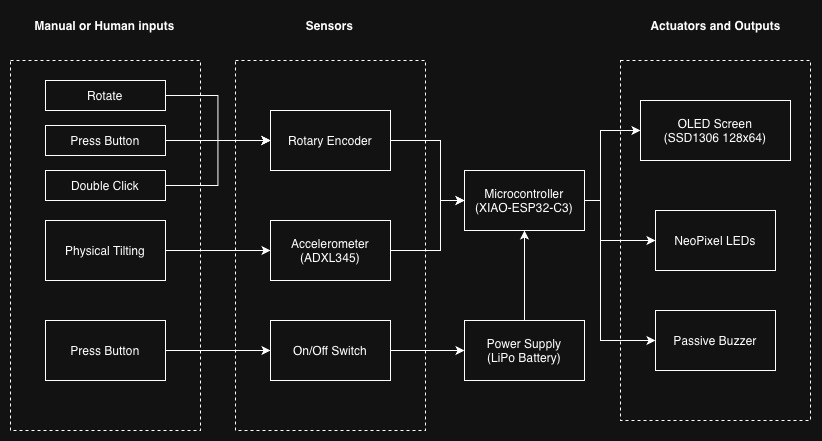
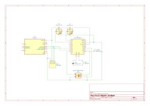

# 💣 3…2…1…BOOM!
A physical puzzle game powered by Xiao-ESP32-C3

## ✍️ Overview
This project is a handheld, motion-controlled bomb defusal game built using Xiao-ESP32-C3 microcontroller, SSD1306 128x64 OLED screen, ADXL345 Accelerometer, Rotary Encoder, LiPo Battery, NeoPixel LEDs, and On/Off Switch.   

Players progress through 10 randomized levels, each requiring a specific tilt angle and knob rotation within a time limit. There are 3 difficulty modes determining how many hints are shown on the screen, making the game more replayable and challenging.

## 👩🏻‍💻 Author

**Zihan Yang**  
TECHIN 512 - Introduction To Sensors And Circuits  
MSTI, University of Washington

## 🎮 How to Play

Refer to the diagram below for the game’s logic flow:

### 1. Power On
Turn on the device using the on/off switch. It will greets you with a short startup animation. After the animation, you’ll automatically enter the difficulty selection menu.

---

### 2. Select Difficulty
Rotate the encoder to browse through the three difficulty modes: **Easy** (Full hints), **Medium** (Limited hints) and **Hard** (countdown only). 

Press the encoder button to confirm your selection and start the game.

---

### 3. Complete Level Tasks

Each game includes 10 randomly generated levels. In every level, you’ll need to complete two tasks before time runs out.   

- **Tilt the box**  
Tilt the enclosure to match the target X/Y angle. The on-screen hints and LED colors help guide your accuracy. 
    - Green: right on target
	- Orange: close
	- Red: far from target

- **Rotate the knob**  
Turn the knob to match the target value. Again, the LED color shows how close you are, shifting from red to orange to green as you move closer to the correct value.

---

### 4. Mind the Timer & Buzzer

Each level gives you 30 seconds. As time counts down,  the buzzer increases in urgency. 
- Slow beeps: 30-10 seconds
- Accelerated beeps: 5–10 seconds
- Rapid alerts: the last 5 seconds
- A continuous tone: the bomb is about to explode.

---

### 5. Complete All 10 Levels

If you finish both tasks before the timer hits 0, you clear the level. The OLED will display “Next Level,” and you’ll move on automatically. 

Make it through all 10 levels to win the game!

---

### 6. Double-Click to Exit

At any moment (during gameplay, after a failure, or on the win screen), you can double-click the encoder button to immediately exit the current game and return to the difficulty selection menu. 

This action bypasses the startup animation, allowing you to start a new game without restarting the device.

## ⚙️ Components Used & Implementation

Refer to the diagram below for the complete wiring layout:

**1. Seeed XIAO ESP32-C3**  
The main microcontroller that runs all game logic, sensor processing, timing, and display control.

**2. ADXL345 Accelerometer**   
Detects the player’s tilt input and checks whether the device matches the required target angles.

**3. Rotary Encoder + Push Button**   
Lets the player adjust the knob value for each level, select difficulty, and perform double-click exit actions.

**4. SSD1306 OLED Display**   
Shows game UI, difficulty, level info, countdown, and visual feedback based on difficulty mode.

**5. Passive Buzzer**   
Produces countdown beeps and continuous alarm tones during the final second for added tension.

**6. NeoPixel LEDs**  
Provide immediate color feedback: one reflects tilt accuracy and one reflects knob correctness.

**7. Li-Po Battery + Power Switch**   
Powers the handheld game, making it portable and fully self-contained.

## 📦 Enclosure Design

The enclosure was designed as a small, TNT-style square box that matches the bomb-defusal concept and is easy to grip and tilt. 

The lid includes precisely measured cutouts for two NeoPixels, the OLED display, and the buttons, making all interactions clear and accessible.

 The enclosure is 3D-printed in PLA for its smooth feel, clean appearance, and ability to produce precise shapes.

 ## License
This project is an academic coursework for TECHIN 512 and for research & educational use only.